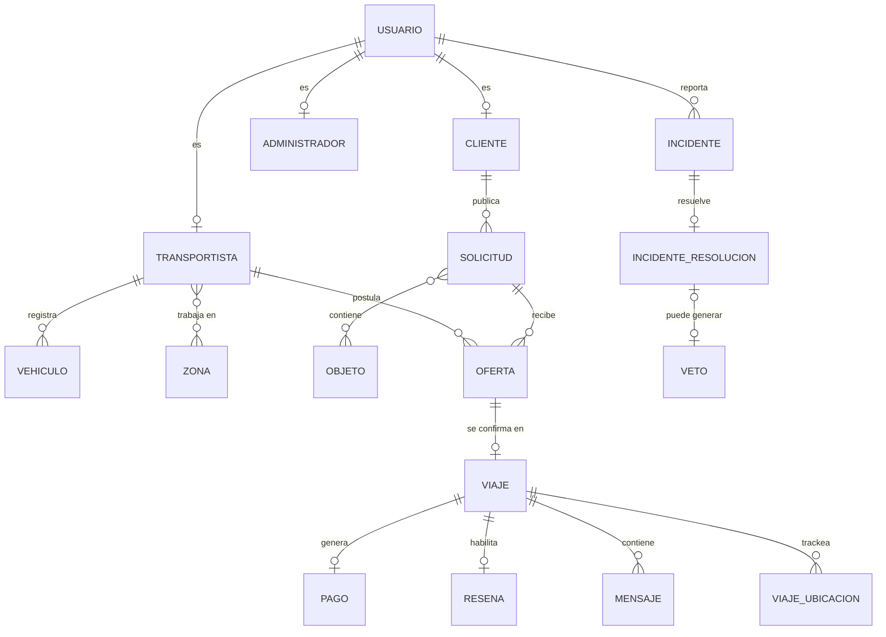

# Fletway — Documentación de la base de datos

Proyecto Supabase: `dbFletway` (`gfadryudaaqyxnkrpbex`) · Postgres 17 · 34 tablas
Este documento describe el esquema **tal como está desplegado hoy** (verificado contra el catálogo de Postgres, no contra los scripts originales) y explica por qué existe cada pieza en términos del negocio.

---

## 1. El negocio, en una hoja

Fletway conecta dos lados de un marketplace de fletes:

- **Cliente**: publica una necesidad de traslado (`solicitud`).
- **Transportista**: se postula voluntariamente (`oferta`) a solicitudes compatibles con su zona y vehículo — modelo *pull*, no asignación forzada.
- **Administrador**: valida documentación de Transportistas, resuelve incidentes y aplica vetos.

El Cliente elige una oferta → se confirma un `viaje` → se ejecuta con verificación por PIN y GPS → se cobra un `pago` (con comisión de plataforma) → el Cliente deja una `resena`. Todo el flujo puede derivar en un `incidente`, y cliente/transportista se comunican por `mensaje` una vez que el viaje está confirmado.

---

## 2. Principios de diseño que atraviesan todo el esquema

**Herencia de identidad.** `usuario` es la tabla base (1:1 con `auth.users` de Supabase Auth — las credenciales viven ahí, no en `public`). `cliente`, `transportista` y `administrador` son extensiones 1:1 (mismo `id` = `usuario_id`). Esto resuelve de forma directa el patrón "reportado por Cliente o Transportista" que aparece en varios requisitos: casi todo (`incidente.reportante_usuario_id`, `mensaje.emisor_usuario_id`, `notificacion.destinatario_usuario_id`) apunta a `usuario`, sin importar el rol.

**3FN + snapshot híbrido (RNF-03).** Las tablas maestras (`usuario`, `vehiculo`, `objeto`, `config_tarifa`, etc.) están normalizadas en 3FN. `viaje` es la excepción intencional: congela en columnas `*_snapshot` todo lo que podría cambiar después (tarifa vigente, datos del vehículo, coordenadas) para que un cambio futuro en una tabla maestra nunca altere un viaje ya confirmado.

**Tablas de referencia en vez de enums.** Todo valor categórico que podría crecer o necesitar metadata (`estado_viaje`, `tipo_incidente`, etc.) es una tabla `codigo/descripcion`, no un `enum` de Postgres — más fácil de extender sin migraciones.

**RLS activo en las 34 tablas**, con Supabase Auth nativo: `auth.uid()` = `usuario.id`. Sección 5 tiene el detalle completo.

---

## 3. Vista general de relaciones

*(Diagrama simplificado — omite las 13 tablas de referencia/catálogo y sus FKs para legibilidad; están documentadas en cada dominio más abajo.)*

---

## 4. Recorrido por dominio

### Dominio 1 — Identidad
*Quién es cada usuario y qué documentación lo habilita.*

| Tabla | Rol en el negocio | Columnas propias (además de PK/FK) |
|---|---|---|
| `usuario` | Base de autenticación (RNF-01). `email`/`telefono` duplicados desde `auth.users` porque ese schema no es accesible por la API pública. | `email` (citext, único), `telefono`, `nombre_completo`, `rol`, `activo` |
| `cliente` | Extensión 1:1 — quién publica solicitudes. | *(solo `usuario_id`)* |
| `administrador` | Extensión 1:1 — personal interno (RF-01 a RF-04). Alta restringida: solo otro admin puede crear uno nuevo. | *(solo `usuario_id`)* |
| `transportista` | Extensión 1:1 — quien ofrece el servicio. | `forma_trabajo`, `disponible`, `estado_habilitacion_codigo`, `calificacion_promedio`, `tasa_cumplimiento` |
| `estado_habilitacion_transportista` | Catálogo: `pendiente` / `habilitado` / `rechazado` (RF-01). | — |
| `tipo_documento` | Catálogo: `dni`, `seguro`, `registro`, `vtv`. | — |
| `documento_transportista` | Historial de cada documento cargado, con motivo de rechazo — soporta "reintentos sin límite" (RF-01). No está en la ERS original; es un desdoblamiento necesario porque un único campo de estado en Transportista no alcanza para trazar reintentos por tipo de documento. | `tipo_documento_codigo`, `url_archivo`, `estado`, `motivo_rechazo`, `revisado_por_admin_id` |

**Protección especial:** un trigger (`trg_proteger_campos_transportista`) impide que el propio Transportista modifique `estado_habilitacion_codigo`, `calificacion_promedio` o `tasa_cumplimiento` vía UPDATE — esos campos solo los toca un Administrador o el sistema.

### Dominio 2 — Geografía
*Cómo se resuelve el matchmaking por zona (RN-04).*

| Tabla | Rol en el negocio |
|---|---|
| `zona` | Localidades/provincias que sirven de unidad de matching. |
| `transportista_zona` | N:M — las zonas donde cada Transportista trabaja. Sin esta tabla, "zona del Transportista coincide con origen/destino de la Solicitud" (RN-04) no sería verificable. |

### Dominio 3 — Vehículos y objetos
*Qué se puede transportar y en qué.*

| Tabla | Rol en el negocio | Columnas propias |
|---|---|---|
| `tipo_vehiculo` | Catálogo de capacidades **estándar** por tipo — necesario porque RN-02 pide calcular cubicaje "para cada posible vehículo" *antes* de que exista un vehículo real asignado (al publicar la Solicitud, RF-06). | `nombre`, `volumen_estandar_m3`, `peso_maximo_estandar_kg` |
| `vehiculo` | Vehículo real de un Transportista (puede tener más de uno — 1:N, cardinalidad no fijada por la ERS). | `patente`, `marca`, `modelo`, `volumen_carga_m3`, `peso_maximo_kg`, `activo` |
| `objeto` | Catálogo de objetos comunes para cotización (RN-08 en la versión vigente de la ERS). | `nombre`, `peso_estimado_kg`, `volumen_estimado_m3` |

### Dominio 4 — Solicitudes y matchmaking
*El corazón del modelo pull (RN-04, RN-05).*

| Tabla | Rol en el negocio | Columnas propias |
|---|---|---|
| `estado_solicitud` | Catálogo: `publicada` / `asignada` / `cancelada` / `expirada`. | — |
| `solicitud` | Necesidad publicada por el Cliente. `origen_zona_id`/`destino_zona_id` son las FK que RN-04 necesita para el matching; `origen_lat/lng` y `destino_lat/lng` son para el cálculo fino de distancia (RN-01). | zonas, direcciones, coordenadas, `requiere_escalera`, `pisos_escalera`, `cantidad_ayudantes_solicitados`, `cotizacion_estimada_monto` |
| `solicitud_objeto` | N:M Solicitud↔Objeto. Soporta tanto ítems del catálogo (`objeto_id`) como carga manual con dimensiones propias (`nombre_personalizado` + peso/volumen) — RF-06 permite ambos modos. | `objeto_id` *(nullable)*, `nombre_personalizado`, `cantidad`, `peso_unitario_kg`, `volumen_unitario_m3` |
| `estado_oferta` | Catálogo: `pendiente` / `aceptada` / `no_seleccionada` / `retirada`. | — |
| `oferta` | Postulación de un Transportista a una Solicitud (RF-17). Solo puede postularse un Transportista **habilitado** (verificado a nivel de policy). | `vehiculo_id`, `cantidad_viajes`, `cantidad_ayudantes`, `precio_calculado`, `estado_codigo` |

### Dominio 5 — Viajes
*La entidad transaccional central — acá vive el snapshot histórico (RNF-03).*

| Tabla | Rol en el negocio |
|---|---|
| `estado_viaje` | Catálogo: `confirmado` / `en_curso` / `finalizado` / `cancelado_cliente` / `cancelado_transportista`. |
| `viaje` | Ver detalle abajo. |
| `viaje_ubicacion` | Serie temporal de posiciones GPS durante el viaje (RI-04, RF-15) — separada de las coordenadas fijas de origen/destino porque el Transportista se mueve *durante* el viaje, no solo al inicio/fin. Solo el propio Transportista puede insertar sus pings. |

`viaje` tiene tres grupos de columnas:
1. **Operativas**: `estado_codigo`, `pin_inicio`/`pin_fin` (+ timestamps de validación), `cantidad_ayudantes`, `finalizado_en`.
2. **Snapshot de ubicación**: direcciones y coordenadas exactas de origen/destino *al momento de confirmar*, más `distancia_km_snapshot`.
3. **Snapshot financiero**: `tarifa_base_snapshot`, `valor_por_km_snapshot`, `valor_por_m3_snapshot`, `valor_por_hora_snapshot`, `recargo_escalera_snapshot`, `recargo_ayudante_snapshot`, `monto_total_snapshot`, `porcentaje_comision_snapshot` — así un cambio futuro en `config_tarifa`/`config_comision` nunca altera un viaje ya confirmado. También congela `transportista_nombre_snapshot`, `vehiculo_patente_snapshot`, `vehiculo_marca_modelo_snapshot`.

Un trigger (`trg_proteger_campos_viaje`) impide que Cliente/Transportista alteren estas columnas snapshot o las FK estructurales vía UPDATE — solo pueden mover estado, PIN y campos operativos.

### Dominio 6 — Pagos
*Comisión de plataforma (RN-03) y su tarifa versionada.*

| Tabla | Rol en el negocio |
|---|---|
| `config_tarifa` | Tarifa base + variables de cálculo (RN-01), **versionada**: `vigente_desde`/`vigente_hasta`, con un índice único que garantiza una sola fila "vigente" (sin fecha de fin) a la vez. No estaba en la ERS original como entidad — RNF-03 la nombra como maestra pero §3.5 no la listaba. Exclusiva para Administrador; Cliente/Transportista solo ven el resultado ya calculado (`precio_calculado`, `cotizacion_estimada_monto`). |
| `config_comision` | Igual lógica de versionado, para el % de comisión (RN-03). |
| `estado_pago` | Catálogo: `pendiente` / `retenido` / `liberado` / `reembolsado_total` / `reembolsado_parcial`. |
| `pago` | Transacción entre Cliente y Transportista, 1:1 con `viaje`. |
| `pago_movimiento` | Ledger de eventos (`captura`, `reembolso_parcial`, `reembolso_total`, `liberacion_parcial`, `liberacion_total`) — necesario porque RF-03 permite reembolsos/liberaciones *parciales*, y una sola fila de `pago` perdería ese historial. Vincula opcionalmente al `incidente` que lo originó. |

### Dominio 7 — Reseñas e incidentes
*Confianza y resolución de conflictos.*

| Tabla | Rol en el negocio |
|---|---|
| `resena` | Calificación del Cliente al Transportista, habilitada solo si el viaje está `finalizado` (RN-06 vigente). Incluye `nombre_cliente_snapshot` — la propia ERS pide este dato congelado. Inmutable una vez publicada. |
| `tipo_incidente` | Catálogo: `fraude`, `dano_carga`, `incumplimiento`, `disputa_pago`, `otro`. |
| `estado_incidente` | Catálogo: `abierto` / `en_revision` / `resuelto`. |
| `incidente` | Reporte de Cliente o Transportista (`reportante_usuario_id` → `usuario`). Solo lo ve el reportante y el Admin — nunca la contraparte (se entera por `notificacion`, no leyendo el incidente ajeno). |
| `veto` | **No estaba en la ERS original como entidad** — RF-04 la describe en detalle (temporal/definitivo, motivo, ligado a un incidente) pero §3.5 nunca la listaba; un campo suelto "vetado" en Usuario no habría alcanzado para trazar historial ni fecha de vencimiento. |
| `tipo_resolucion_incidente` | Catálogo: `reembolso_total`, `reembolso_parcial`, `liberacion_total`, `liberacion_parcial`, `veto`, `cierre_sin_accion`. |
| `incidente_resolucion` | La decisión del Admin sobre un incidente, separada del incidente en sí — permite trazar qué admin resolvió qué y cómo, sin mezclar "el problema" con "la resolución". |

### Dominio 8 — Notificaciones y chat
*Comunicación del sistema y entre las partes.*

| Tabla | Rol en el negocio |
|---|---|
| `tipo_notificacion` | Catálogo de 9 tipos de evento (viaje confirmado, pago procesado, incidente resuelto, etc.). |
| `notificacion` | Aviso a un `usuario` (RF-09). |
| `mensaje` | **No estaba en la ERS original como entidad**, pese a tener 3 requisitos dedicados (RF-10, RF-20, RI-05). No existe una tabla "Conversación" separada: el chat está atado 1:1 a `viaje_id`, lo que implementa directamente la regla "chat habilitado solo tras aceptar el viaje" — no puede haber `mensaje` sin que exista primero el `viaje`. |

---

## 5. Seguridad — quién puede hacer qué

Todas las tablas tienen RLS activo. Filosofía general: **lectura pública** en catálogos y perfiles (Transportista, reseñas — son un marketplace, no un sistema privado); **propiedad** en todo lo transaccional; **Administrador** con acceso total y algunas acciones (habilitación, tarifas, vetos, resoluciones) exclusivas suyas.

| Tabla | Cliente | Transportista | Administrador |
|---|---|---|---|
| `usuario` / `cliente` | ve/edita lo propio | ve perfiles de transportista (públicos); ve al cliente con quien tiene una oferta activa | todo |
| `administrador` | — | — | ve lo propio + otros admins; alta solo por otro admin |
| `transportista` / `vehiculo` | lectura pública | lectura pública; edita lo propio (campos de habilitación protegidos por trigger) | todo |
| `documento_transportista` | — | sube los propios | revisa (aprueba/rechaza) |
| `zona`, `tipo_vehiculo`, `objeto`, catálogos `estado_*`/`tipo_*` | lectura pública | lectura pública | ABM completo |
| `transportista_zona` | lectura pública | gestiona las propias | ABM completo |
| `solicitud` | ve/crea/edita las propias | ve publicadas de su zona + en las que ya se postuló | todo |
| `solicitud_objeto` | hereda visibilidad de `solicitud` | hereda visibilidad de `solicitud` | todo |
| `oferta` | ve las de sus solicitudes; acepta/rechaza | crea/ve/retira las propias (requiere estar habilitado) | todo |
| `viaje` | ve/actualiza el propio | ve/actualiza el propio | todo (campos snapshot protegidos por trigger) |
| `viaje_ubicacion` | ve el de sus viajes | inserta solo en sus propios viajes | todo |
| `config_tarifa` / `config_comision` | — | — | exclusivo |
| `pago` / `pago_movimiento` | ve el de sus viajes | ve el de sus viajes | gestiona |
| `resena` | lectura pública; inserta solo sobre su propio viaje finalizado | lectura pública | — |
| `incidente` | ve/crea lo propio (no ve el de la otra parte) | ve/crea lo propio | ve todo, cambia estado |
| `veto` | ve el propio | ve el propio | ABM completo |
| `incidente_resolucion` | ve la de incidentes que reportó | ve la de incidentes que reportó | ABM completo |
| `notificacion` | ve/marca leídas las propias | ídem | ve todo, crea manuales |
| `mensaje` | ve/envía en sus propios viajes | ídem | ve todo |

Todas las políticas usan `(select auth.uid())` (no `auth.uid()` directo) para que el planner de Postgres lo evalúe una sola vez por consulta en vez de por fila — recomendación estándar de performance de Supabase para RLS a escala.

---

## 6. Qué no está en esta base (a propósito)

Por la restricción de alcance acordada: **no** hay ampliación automática de radio de búsqueda (RN-06 de la ERS original quedó descartada para esta versión — RN-04 se implementa tal cual, sin ventanas de tiempo ni ensanchamiento de zona). Tampoco hay reseña inversa (Transportista calificando a Cliente), ni autenticación social, ni multi-idioma — nada que no se desprenda de un RF/RN concreto.

---

## 7. Datos de referencia ya cargados

Las tablas catálogo (`estado_*`, `tipo_*`, `tipo_vehiculo`, `objeto`) ya tienen filas semilla (3 a 9 registros cada una, ver conteos en Supabase). Los valores de `config_tarifa` y `config_comision` son **ilustrativos** — hay que reemplazarlos por los reales del negocio antes de producción.
